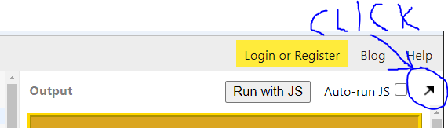

# first-website-html-course
**For use with the HTML and CSS summer camp course.**

This project walks through the creation of a nice-looking personal website over the course of several days. The project is meant to be completed on jsbin.com, and is divided up into sections as described below.


**Table of Contents**
 
- [Preliminary](#preliminary)
- [Lesson 1 Steps](#lesson-1-steps)
    - [TODO 1: Change the Title](#todo-1-change-the-title)
    - [TODO 2: Add Content](#todo-2-add-content)
- [Lesson 2 Steps](#lesson-2-steps)
    - [TODO 1: Container Div](#todo-1-container-div)
    - [TODO 2: Nav Section](#todo-2-nav-section)
    - [TODO 3: Main Section](#todo-3-main-section)
    - [TODO 4: Image Link](#todo-4-image-link)
- [Lesson 3 Steps](#lesson-3-steps)
    - [TODO 1: Update Nav Section](#todo-1-update-nav-section)
    - [TODO 2: Interests Section](#todo-2-interests-section)
- [Lesson 4 Steps](#lesson-4-steps)
    - [TODO 1: Add in Borders](#todo-1-add-in-borders)
    - [TODO 2: Add in Background Colors](#todo-2-add-in-background-colors)
    - [TODO 3: Change Text Colors](#todo-3-change-text-colors)
- [Lesson 5 Steps](#lesson-5-steps)
    - [TODO 1: Update Existing Rules](#todo-1-update-existing-rules)
    - [TODO 2: New Main Section](#todo-2-new-main-section)
    - [TODO 3: Likes and Dislikes](#todo-3-likes-and-dislikes)
- [Lesson 6 Steps](#lesson-6-steps)
    - [TODO 1: Center Your Preferences](#todo-1-center-your-preferences)
    - [TODO 2: Customize Your Web Page](#todo-2-customize-your-web-page)
- [Lesson 7 Steps](#lesson-7-steps)
    - [TODO 1: Fix Margins and Padding](#todo-1-fix-margins-and-padding)
    - [TODO 2: Global Customization](#todo-2-global-customization)
- [Lesson 8 Steps](#lesson-8-steps)
    - [TODO 1: Combinator Selector Rules](#todo-1-combinator-selector-rules)
    - [TODO 2: Add in Shadows](#todo-2-add-in-shadows)

<hr>

## Preliminary 

### About Saving
No matter where you are, whenever you are done working for the day, make sure you do two things to save your work. JS Bin autosaves, but it's better to have backups than risk a bug causing you to lose everything!

**Save step 1:** Go to "File" and click "Save snapshot"
**Save step 2:** Go to "File" and click "Download"

Remember to do this every day so you can always continue right where you left off!

### About Loading
To open your file after returning, click on "Open bin..." and find the entry with the title of your website on it. If you open it and it is not where you left off, then open up the most recent shapshot you made instead (it will always be right below the main entry for your website).

If for some reason you don't have an entry for your website, you will need to open the copy you downloaded in the previous session, then copy and paste all of it directly into JS Bin. This should never happen, by the way, but just in case it does, that's what you need to do to get your work back on it.

<hr>
<hr>

## Lesson 1 Steps
Today's lesson steps will add in several of the basic components of a website, including a title, some headers, a link, an image, and a paragraph.

### TODO 1: Change the Title
To start, click "New bin". Then, go ahead and change the web page's title. By default, it says "JS Bin", as seen below.

```html
<!DOCTYPE html>
<html>
<head>
  <meta charset="utf-8">
  <meta name="viewport" content="width=device-width">
  <title>JS Bin</title>
</head>
<body>

</body>
</html>
```

See the `<title> ... </title>` tags? Change "JS Bin" to the title you want your website to have. Keep in mind this will only show up in your browser tab, and only if you open the website into its own tab outside of JS Bin. To do that click the expand button as highlighted in the image below.



### TODO 2: Add Content
Once your webpage has a title, it's time to add some content in there! Everything you want to show up on your website needs to be between the `<body> ... </body>` tags, so that's where you'll be doing these next steps. There are **6** things you'll want to add. Make sure you put all of them in, and **don't forget to indent when you add in new elements!**

#### Addition 1
The first thing you want to add is a header displaying your title on your website. To do that, use the `<h1> ... </h1>` tags to make some very big text, and put the title you want between the opening and closing tags.

#### Addition 2
Next, a good website should have links in it. You should link to the Operation Spark website to show where you learned to code! Use an anchor tag `<a href="url"> What to click </a>` to link to Operation Spark.

The Operation Spark URL is "https://operationspark.org/", by the way. Also, instead of "What to click", why not put something more appropriate, like either "Taught By" or simply "Operation Spark"?

#### Addition 3
This is your website, so your name should be on here in big letters. Use `<h2> ... </h2>` tags to do that, and remember to put your name in between them!

#### Addition 4
Next, a good website should have picture, right? Go ahead and use an `` tag to embed an image into your website. Feel free to do a Google search to find one that you want. When you find an image, you need to right click on it, then select "copy image address", then paste that URL into your HTML as the "image url".

#### Addition 5
Now, add in another **h2** header that contains the words "About Me".

#### Addition 6
Final addition: put in a small paragraph (`<p> ... </p>`) that describes you! It doesn't have to be much, even a single line will do.

In the end, your code should look something like this:

```html
<!DOCTYPE html>
<html>
<head>
  <meta charset="utf-8">
  <meta name="viewport" content="width=device-width">
  <title>Website Title</title>
</head>
<body>
  <h1> Website Title </h1>
  <a href="https://operationspark.org/"> Taught By </a>
  <h2> Your name </h2>
  
  <h2> About Me </h2>
  <p> Stuff about you </p>
</body>
</html>
```

<hr>

## Lesson 2 Steps
Today's lesson steps will help you divide your website into different sections. You'll also add in a few more bits of content and turn you image into a link, all to make your website a bit more engaging!

### TODO 1: Container Div
To begin with, you'll want to wrap up everything in your **body** with a **div**, and the **div** should have and id of "id=all-contents". The reason for this won't become clear until you start adding in your CSS, but suffice it to say that eventually it will be used to make sure that your web page is centered and the right size.

When you're done, your code should look something like this:

```html
<body>
    <div id="all-contents">
        <!-- A bunch of stuff from yesterday. -->
    </div>
</body>
```

Make sure that you **indent** everything properly! A quick way to do that is to highlight all of the lines you want to indent, and then press "Tab" on your keyboard.

### TODO 2: Nav Section

A good web page has a navigation section. To do so, put in a custom pair of tags called `<nav> ... </nav>`, and make sure they go around your **h1** header and your **anchor** tags. 

After you've done that, add in another anchor tag to the nav area. This new anchor tag should have the URL of "https://jsbin.com" and the text "JS Bin". When finished, your code should look something like this:

```html
<body>
    <div>
        <nav>
            <h1> Your header </h1>
            <a href="https://operationspark.org"> Taught By </a>
            <a href="https://jsbin.com"> JS Bin </a>
        </nav>

        <!-- More stuff -->

    </div>
</body>
```
Again, don't forget to **indent!**

### TODO 3: Main Section
The goal here is to put all of the rest of your content into one big section, and then divide that sectino up into smaller parts. This is a big one, so we'll break it up into 3 steps.

#### Step 1:
Put custom `<main> ... </main>` tags around your **h2** headers, your **image**, and your **paragraph**. Then, indent the stuff inside!

Code afterward:

```html
<body>
    <div>
        <nav> ... </nav>

        <main>
            <h2> ... </h2>
            
            <h2> ... </h2>
            <p> ... </p>
        </main>
    </div>
</body>
```

#### Step 2:
Put a new div inside of the **main** section and give it an id of "id=sidebar". This div should wrap around your first **h2** section and your **img**.

#### Step 3:
Put *another* new div inside of the **main** section and give it an id of "id=about". This div should wrap around your second **h2** section and your **paragraph**.

At the end of all of this, your main section should look similar to this:

```html
    <main>
        <div id="sidebar">
            <h2> ... </h2>
            
        </div>
        <div id="about">
            <h2> ... </h2>
            <p> ... </p>
        </div>
    </main>
```

### TODO 4: Image Link
Next, add something a little fun into your website. Go ahead and turn your image into a link to whatever (appropriate) website you'd like. As a reminder, you can make an image a link by putting the image inside of an anchor tag, like so:

```html
<a href="url to somewhere"> 
     
</a>
```

<hr>

## Lesson 3 Steps
Today's lesson is all about adding in some lists to your website. One will be an interests list, and one will be a navigation list. You already have the pieces of the navigation list, so you'll work on that first.

### TODO 1: Update Nav Section
The first thing you'll want to do is put `<ul> ... </ul>` tags around your anchor tags in your nav area. Once you've done that, put `<li> ... </li>` tags around each anchor. Your result should look similar to:

```html
<nav>
    <h1> Your header </h1>
    <ul>
        <li> <a href="https://operationspark.org"> Taught By </a> </li>
        <li> <a href="https://jsbin.com"> JS Bin </a> </li>
    </ul>
</nav>
```

### TODO 2: Interests Section
The last new thing you'll need to do today is create a new section in your "about" area. This will done is several steps.

#### Step 1:
Put custom `<section> ... </section>` tags inside of your "about" div. Make it look like this:

```https
<div id="about">
    <h2> ... </h2>
    <p> ... <p>
    <section>
    </section>
</div>
``` 

#### Step 2:
Put an **h3** header inside of your **section** with the text "Interests"

#### Step 3:
Put in `<ul> ... </ul>` tags just below the **h3** header. Give the opening `<ul>` tag an id of "id=interests".

#### Step 4:
Lastly, put at least 3 **li** tags inside your **ul**, and use them to list some of your interests! In the end, your code should look similar to this:

```https
<section>
    <h3> Interests </h3>
    <ul id="interests">
        <li> Interest 1 </li>
        <li> Interest 2 </li>
        <li> Interest 3 </li>
    </ul>
</section>
``` 

<hr>

## Lesson 4 Steps
Today you'll finally be getting to CSS and beginning to customize the look of your website! No more boring black text and white backgrounds. Finally, you'll have a web page with some style!

### TODO 1: Add in Borders
To start with, go ahead and put in some borders for your different sections. To start with, put one around your `nav` section. Here's some example code for how you could style your **nav**, but absolutely feel free to change it up a bit!

```css
nav {
    border: 4px gold ridge;
}
```

After you've put a border around your **nav** try putting one around your `main` section and your `img`, too! 

### TODO 2: Add in Background Colors
Once you've got some nice, fancy borders, the next thing you'll want to do is give each section a background color. You can do this by just adding in the `background` property to your existing rules for the `nav` and `main`. For example, your **nav** rule might look something like *this* when you're done:

```css
nav {
    border: 4px gold ridge;
    background: black;
}
```

After you've given good background colors to your **nav** and **main** sections, you might want to give a background to your **body** as well. You can do that the exact same way you would for any other section!

### TODO 3: Change Text Colors
Only one more thing to do for today, and that's change the text colors (if you want to)! By simply adding in the `color` property to any of your rules (or making new rules altogether), you can customize your text color as well! For instance, here's a **nav** rule that's got all of the above properties in it:

```css
nav {
    border: 4px gold ridge;
    background: black;
    color: white;
}
```

<hr>

## Lesson 5 Steps
Now that you've seen more properties and learned about class selectors, you're ready to add in more style to your website! You'll also be adding in just a tad bit more HTML, just to show off the utility of class selectors.

### TODO 1: Update Existing Rules
First, you'll want to update some of the rules that you already have to include display and margin properties. You also might want to change the image size, if you haven't already done that on your own. 

#### Step 1
First, add in a rule for the `img` tag and give it `width` and `height` properties. For example:

```css
img {
    width: 200px;
    height: 200px;
}
```

#### Step 2
Find your `nav` and your `main` rules. For both of them, add in the property `display: flex;`.

#### Step 3
Lastly, add to your `main` rule the property `margin-top: 8px;`.

### TODO 2: New Main Section
You're going to need a new **main** section to really show off the power of class selectors, and it will also add some more content to your website! 

Find where your already existing **main** ends, and add in another pair of `<main> ... </main>` tags right after that. Also, be sure to give *this* **main** section and id of "id=likes-and-dislikes".

Once you've done that, put two more pairs of `<section> ... </section>` tags inside of your new **main**. The first **section** elements needs to have an id of "id=likes" and your second needs and id of "id=dislikes".

At this point, your code should look like this:

```html
<div id="all-contents">
    <nav> ... </nav>
    <main>
        ...
    </main>
    <main id="likes-and-dislikes">
        <section id="likes">
        </section>
        <section id="dislikes">
        </section>
    </main>
</div>
```

### TODO 3: Likes and Dislikes
Okay, last, you need to put some content into your "likes" and "dislikes" sections. Let's start with the HTML for this.

#### Step 1: HTML
Both the "likes" and "dislikes" sections need the exact same things. 

1. An `<h2> ... </h2>` element that says either "Likes" or "Dislikes"
2. A `<ul> ... </ul>` element of class "class=preferences"
3. Three `<li> ... </li>` elements inside of each **ul** element detailing your likes and dislikes

For example, here's what the "likes" section might look like:

```html
<section id="likes">>
    <h2> Likes </h2>
    <ul class="preferences">
        <li> Water </li>
        <li> Rain </li>
        <li> Puddles </li>
    </ul>
</section>
```

#### Step 2: CSS
Okay, finally, put in some CSS rules for those like lists! Use a class selector for the rules. Here's a suggestion for what to try, but feel free to change it to suit your style!

```css
.preferences {
    border: white 2px solid;
    color: yellow;
    padding-right: 16px;
    padding-left: 16px;
}
```

<hr>

## Lesson 6 Steps
Today is mostly a day to touch up your website and catch up on all the previous days' work. There is one new thing to do, though, and that's listed right below.

### TODO 1: Center Your Preferences
This is the only new thing you need to do. Your "likes" and "dislikes" lists aren't exactly centered as they are now, but there's an easy way to fix that.

Today you learned about a way to center different elements using a specific value for the `margin` property. Go ahead and add that property into your `.preferences` rule, and that's it!

### TODO 2: Customize Your Web Page
If you've done absolutely everything up until this point, go ahead and start adding in your own features to your website (if you haven't already). This can include new CSS rules, new properties to existing CSS rules, or even adding in more elements to your HTML! 

Do whatever you think you need to make your website be *your* website, and have fun with it!

<hr>

## Lesson 7 Steps
Today you learned about id selectors. You've been putting them into your HTML all this time, but haven't really been doing much with them. Now it's time to change that!

### TODO 1: Fix Margins and Padding
You have several tags with id labels but no rules for them! Let's take care of three of them here. 

**Make rules for the following:**

1. The sidebar
    * Selector: `#sidebar`
    * Properties: 
        1. `margin: auto;` 
        2. `padding: 16px;`
2. The about area
    * Selector: `#about`
    * Property: `margin: auto;`
3. The likes and dislikes area
    * Selector: `#likes-and-dislikes`
    * Property: `padding: 16px;`

### TODO 2: Global Customization
There's still one more div with an id that hasn't been given a rule. You can do that here, but while you're at it, you might as well finish customizing your main background, assuming you haven't done it already.

Start by adding in the following rule for your "all-content" div.

```css
#all-content {
    max-width: 800px;
    margin: auto;
}
```

Once you've done that, put in a tiled (or singular) background image for you **body**. You don't need an id selector for this. Just use a tag type selector and combine that with what was covered today about backgrounds!

<hr>

## Lesson 8 Steps
Time for the last few CSS rules for your website! For today's steps, you'll be adding in a few rules with some properties you might not have seen before, but that's okay! You add them in the same way you do any other property, and we'll explain the ones you haven't seen before.

### TODO 1: Combinator Selector Rules
There are three new rules you'll need to add here that use combinator selectors. They are listed below.

1. The nav header
    * Selector: `nav h1`
    * Properties: 
        1. `display: flex;`
        2. `align-items: center;`
        3. `margin-left: 16px;`
        4. `color: #FFFFFF;`
        5. `flex: 1;`
    * Explanation: The two properties `display: flex;` and `align-items: center;` work together to center your header vertically. The `margin-left: 16px;` property gives a little bit of space between your header and the left edge of your nav. Finally, the `flex: 1;` property actually shifts your list of links over to the right of the nav section.

2. The nav list items
    * Selector: `nav li`
    * Properties: 
        1. `display: inline-block;`
        2. `padding: 10px;`
    * Explanation: "inline-block" is another value that can be given to the **display** property. Its use is to display lists horizontally. It also has the side-effect of removing bullet points from a list.
3. The nav links
    * Selector: `nav a`
    * Properties: 
        1. `text-decoration: none;`
        2. `color: purple;`
    * Explanation: `text-decoration: none;` is a property that makes text lose many extra features, such as underline.

### TODO 2: Add in Shadows
And here it is, the absolute last TODO! For this, you'll want to add in shadows to your program. For starters, try putting a **box-shadow** in your **main** rule, another **box-shadow** in your **nav** rule, and a **text-shadow** in your **nav h1** rule.

As a reminder, a shadow property with a single level of shadow look something like this:

```css
box-shadow: 4px 4px 8px blue;
```

while a shadow property with multiple levels of shadow have each shadow separated by ',' like this:

```css
text-shadow: 0px 0px 4px red, 0px 0px 8px blue;
```

<br>
<hr>
<hr>

## Congratulations!
That's it! You've now got a website with some nice content and tons of style features in it. Feel free to add as much more as you want or to tweak anything that you've already done. This is your website, so make sure it screams "YOU!"

Once you're done, be sure to make a copy of your website by downloading it to your computer. That way, you can always migrate your web page somewhere else if you decide you want to try to host it somewhere other than on jsbin in the future.
